# An Evaluation of the Louisville Free Public Library Inventory Coverage in High-Need Areas

This project analyzes the distribution of the Louisville Free Public Library inventory as a whole and within its individual branches. The goal is to determine if there are areas underserved in regards to library branch locations or collections; in addition, the evaluation may also highlight library branches that stand out with regard to a particular service. The outcomes may provide insight for the city of Louisville and the library system in determining the allocation of new products or next steps in expanding the branch locations.

## How to Use

### 1. Clone the Repository and Handle Large File Downloads:
#### Git LFS setup (if not installed):
Download and install Git LFS: https://git-lfs.github.com
&
run:

```
git lfs install
```

#### Clone the Repository:

``` 
git clone https://github.com/btl930/louisville_library_inventory_analysis.git

cd louisville_library_inventory_analysis
``` 

### 2. Create and Activate a Virtual Environment:

#### Windows (Powershell)

```
python -m venv venv
./venv/Scripts/activate
```

#### macOS/Linux

```
python3 -m venv venv
source venv/bin/activate
```

#### To Deactivate:

```
deactivate
```

#### Install Dependencies:  

```
pip install -r requirements.txt
```

### 3. Rebuild Database
```
sqlite3 database.db < schema.sql
python load_data.py
```

### 4. Run the Project

Run the project on VS Code (make sure Jupyter extension is installed):

```
code .
```

or on a Jupyter Notebook:

```
jupyter notebook
```


## Objectives

1. When considering geographic location, how do library branch distributions align with regions in need?

2. How are item types and collections distributed across the library as a whole and within each individual branch? 

## Conclusions

Louisville is not unique in that there are those in the community needing extra support and resources. The Office of Social Services can provide many resources to those who apply, but it also helpful to evaluate other ways one get much needed resources.

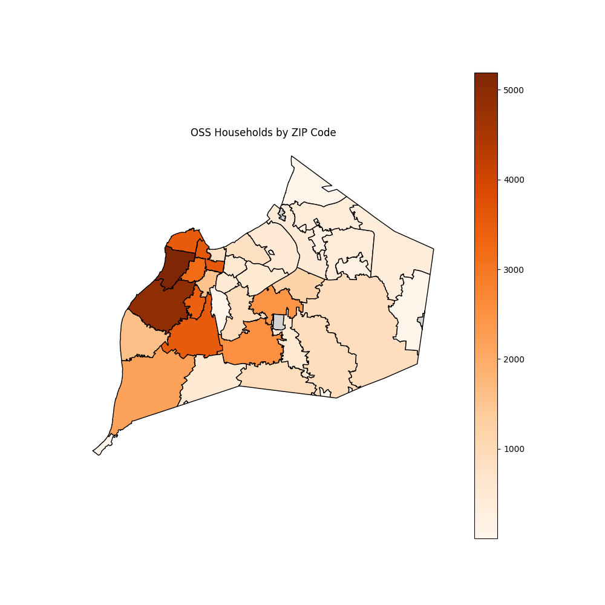

One's local library can be a major resource in a fast-moving and expensive society. Several LFPL branches-including Shawnee, Portland, and Shively-serve communities with the highest amount of OSS Households.

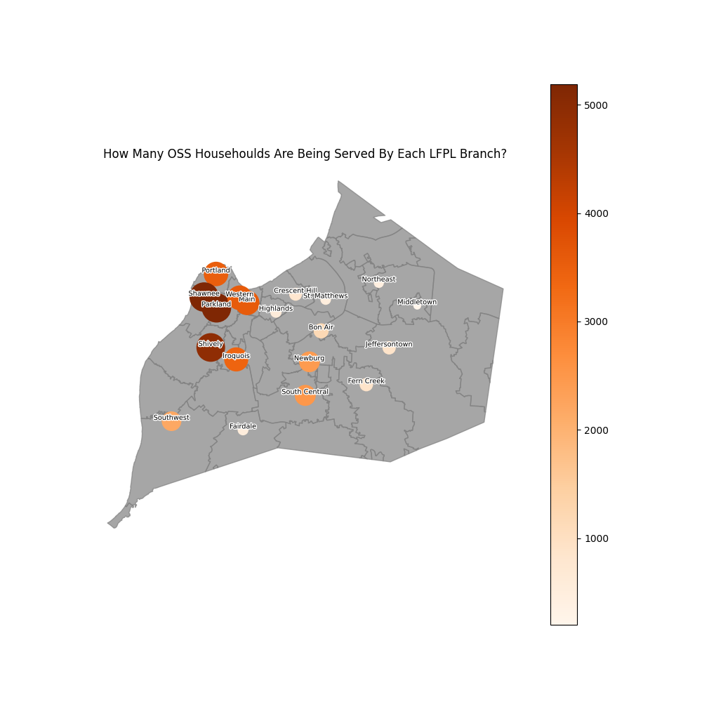


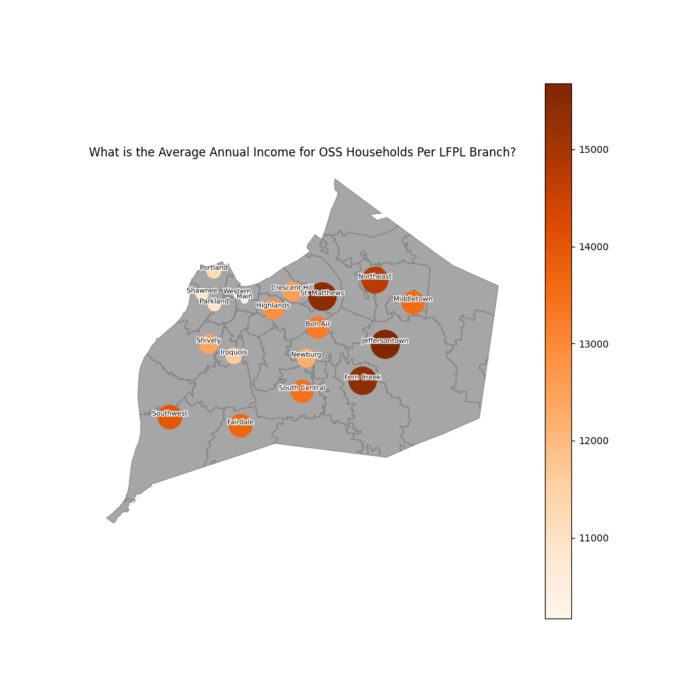

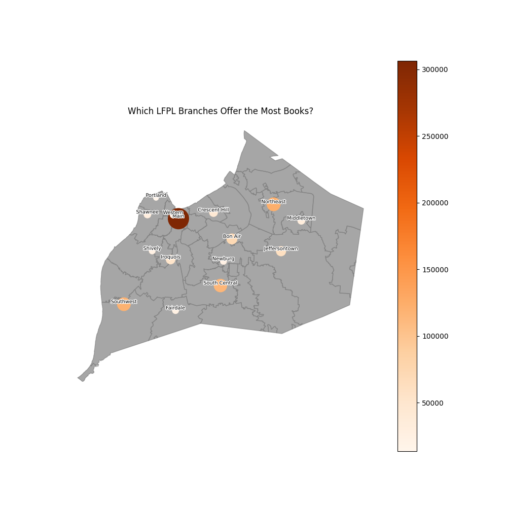

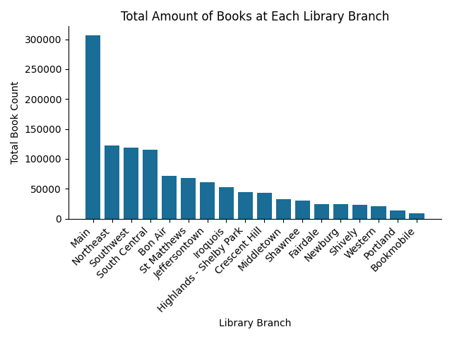

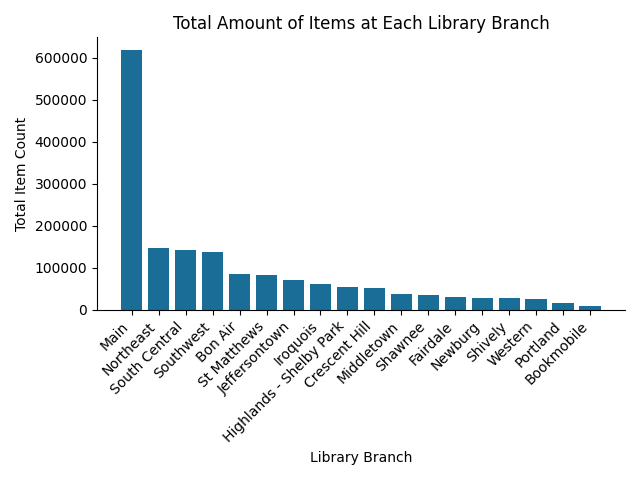

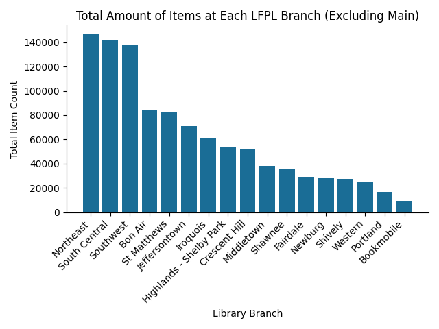

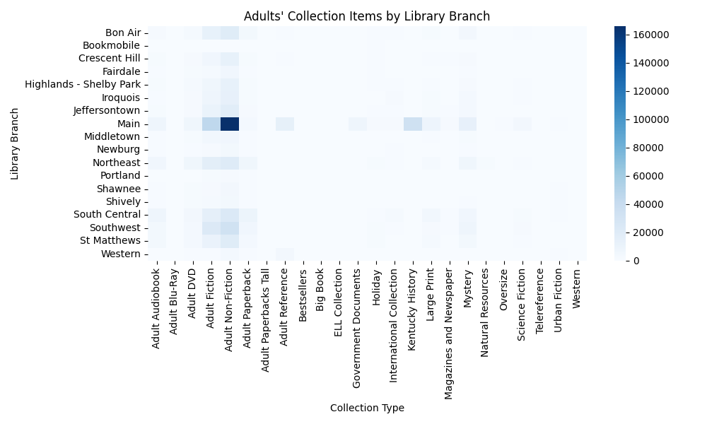

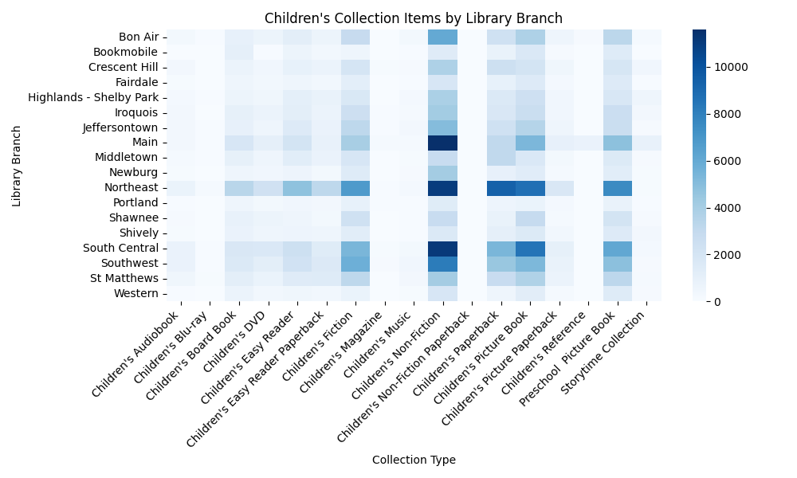

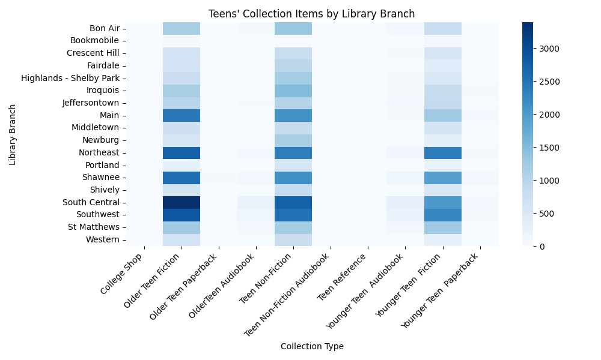

A resource that can be extremely helpful to anyone in the community is electronic resources.

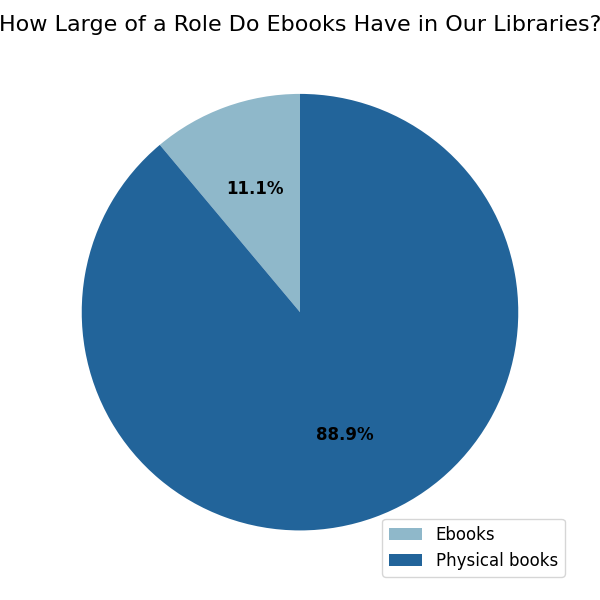

1. The majority of the collection is housed at the Main branch, which makes sense as it is the oldest branch, houses the majority of electronic items, and serves a more archival role than the other branches.
2. The majority of the branches with smaller collections are located on the West side of Louisville; however, there are more library branches centered there. The library branch that likely serves the largest area with the smallest collection is either Fairdale or Middletown. Please note, however, that these findings are based on collection size and geographic proximity and do not account for population density.
3. The Main, Northeast, and South Central branches have the highest concentration of children's books. The Northeast branch has the highest diversity of genres among those books.
4. The South Central, Southwest, Northeast, Shawnee, and Main branches have the highest concentration of teen books with South Central and Southwest having the highest diversity of genres.
5. The Main branch has the highest concentration of adult books. Within this, the Main branch also has the highest amount of government documents and Kentucky history books showcasing its use as an archive.
6. The adult non-fiction genre has a higher count than fiction.

## Continuing Questions

1. Is there a dataframe with LFPL's circulation data? Is there an API available to get the most current information to see how each branch's collection is being used?
2. How do the percentages of item types between each branch compare?
3. How has the LFPL collection changed over time?
4. How have electronic resources changed over time?
5. How does the LFPL collection compare to another city of comparable size and population?
6. How does the percentage of electronic resources in LFPL compare to other libraries? 

## Data Sources

### Louisville Free Public Library Inventory Data:
Source: https://louisville-metro-opendata-lojic.hub.arcgis.com/datasets/LOJIC::louisville-metro-ky-library-collection-inventory-/explore

Description: This is a CSV file of LFPL's collection inventory that is updated regularly. Fields used are Title, ItemType, ItemCollection, ItemLocation, and ItemPrice.

Author: Louisville Free Public Library

### OSS Households Demographics
Source: https://data.louisvilleky.gov/datasets/LOJIC::oss-households-demographics/explorehttps://data.louisvilleky.gov/datasets/LOJIC::oss-households-demographics/explore

Description: This is a CSV file containing the demographics of households that applied for services through the Office of Social Services in Jefferson County, KY. Fields used are Date_Added, Household_Type, Household_Size, Annual_Income, and Zip_Code.

Author: Louisville Metro Open Data

### Louisville KY Free Public Libraries
Source: https://data.louisvilleky.gov/datasets/LOJIC::louisville-ky-free-public-libraries-1/about

Description: This includes CSV and SHP files regarding the geographic locations of LFPL branches. Fields used are LFPL_NAME, LFPL_LOC, LATITUDE, LONGITUDE, X, and Y.

Author: Louisville Metro Open Data

### Jefferson County, KY Zip Codes:
Source: https://data.louisvilleky.gov/datasets/LOJIC::jefferson-county-ky-zip-codes/about

Description: This includes CSV and SHP files regarding the zip code boundaries of Jefferson County, KY. Fields used are Zipcodes, SHAPEAREA, and SHAPELEN.

Author: Louisville Metro Open Data

## Author

Brittany Loder – Data Analyst


